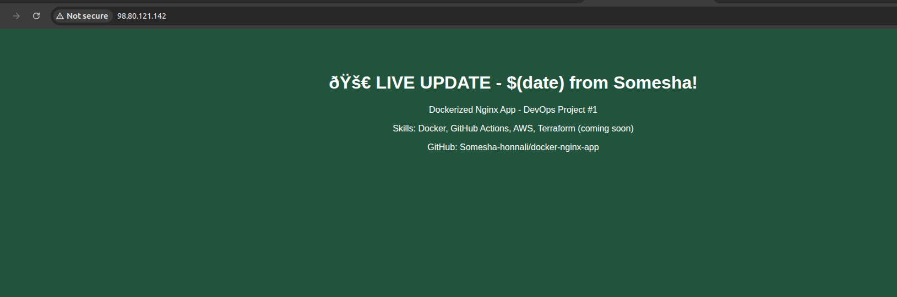
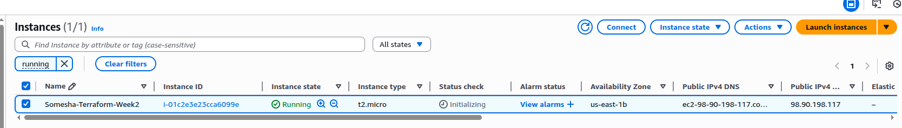
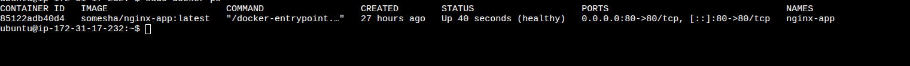

# Terraform EC2 Infrastructure with Dockerized Nginx

Infrastructure as Code (IaC) solution using Terraform to provision and configure AWS EC2 instances with automated Docker deployment.

## Table of Contents

- [Overview](#overview)
- [Architecture](#architecture)
- [Prerequisites](#prerequisites)
- [Getting Started](#getting-started)
- [Configuration](#configuration)
- [Deployment](#deployment)
- [Management](#management)
- [Cleanup](#cleanup)
- [Troubleshooting](#troubleshooting)

## Overview

This project automates the complete lifecycle of EC2 infrastructure provisioning and application deployment. It eliminates manual AWS console operations by providing repeatable, version-controlled infrastructure definitions that can be deployed consistently across environments.

### Key Features

- **Infrastructure as Code**: Complete EC2 infrastructure defined in Terraform
- **Dynamic AMI Selection**: Automatically selects the latest Ubuntu 22.04 LTS image
- **Automated Provisioning**: Zero-touch deployment from code to running application
- **Security Best Practices**: Configured security groups with minimal required access
- **Docker Integration**: Automated container deployment via user data script
- **State Management**: Full Terraform lifecycle with state tracking
- **Cost Control**: Easy infrastructure teardown to avoid unnecessary charges

### What You'll Learn

- Terraform provider configuration and resource management
- AWS data sources for dynamic resource selection
- Security group configuration and network policies
- EC2 instance provisioning and tagging
- User data scripts for instance bootstrapping
- Docker installation and container orchestration
- Infrastructure state management and cleanup

## Architecture

### Infrastructure Components

```
AWS Region
  └── VPC (Default)
      ├── Security Group
      │   ├── Ingress: SSH (22)
      │   └── Ingress: HTTP (80)
      │
      └── EC2 Instance (t2.micro)
          ├── Ubuntu 22.04 LTS
          ├── Docker Engine
          └── Nginx Container (Port 80)
              └── somesha/nginx-app:latest
```

### Terraform Resources

- **Provider**: AWS with region configuration
- **Data Source**: Latest Ubuntu 22.04 AMI lookup
- **Security Group**: Network access control
- **EC2 Instance**: Compute resource with automated setup
- **Outputs**: Public IP and instance information

### Bootstrapping Process

When the EC2 instance launches, the user data script executes:

1. Updates system package repositories
2. Installs Docker Engine and dependencies
3. Configures Docker service to start on boot
4. Pulls the application image from Docker Hub
5. Launches the Nginx container on port 80

## Prerequisites

### Required Tools

- **AWS Account**: Active account with billing enabled
- **AWS CLI**: Configured with valid credentials (`aws configure`)
- **Terraform**: Version 1.x or higher
- **Git**: For version control
- **SSH Key Pair**: For EC2 instance access (optional for this deployment)

### AWS IAM Permissions

Your AWS user/role needs the following permissions:

- `ec2:DescribeImages`
- `ec2:DescribeInstances`
- `ec2:RunInstances`
- `ec2:TerminateInstances`
- `ec2:CreateSecurityGroup`
- `ec2:DeleteSecurityGroup`
- `ec2:AuthorizeSecurityGroupIngress`
- `ec2:DescribeSecurityGroups`
- `ec2:CreateTags`

### Docker Image

The project deploys `somesha/nginx-app:latest` from Docker Hub. Ensure this image is:
- Published and publicly accessible
- Tagged with `latest`
- Configured to run on port 80

### Installation Verification

```bash
# Verify AWS CLI
aws --version
aws sts get-caller-identity

# Verify Terraform
terraform --version

# Verify Git
git --version
```

## Getting Started

### Clone the Repository

```bash
git clone <repository-url>
cd terraform-ec2
```

### Project Structure

```
terraform-ec2/
├── main.tf          # Terraform configuration
├── README.md        # Documentation
├── .gitignore       # Excluded files
└── docs/            # Additional documentation
```

### Configure AWS Credentials

Ensure your AWS credentials are configured:

```bash
aws configure
```

Provide your:
- AWS Access Key ID
- AWS Secret Access Key
- Default region (e.g., `us-east-1`)
- Default output format (e.g., `json`)

## Configuration

### Terraform Configuration File (main.tf)

The main configuration includes:

**Provider Block:**
```hcl
provider "aws" {
  region = "us-east-1"
}
```

**Data Source for AMI:**
```hcl
data "aws_ami" "ubuntu" {
  most_recent = true
  owners      = ["099720109477"] # Canonical

  filter {
    name   = "name"
    values = ["ubuntu/images/hvm-ssd/ubuntu-jammy-22.04-amd64-server-*"]
  }
}
```

**Security Group:**
- Allows SSH (port 22) from anywhere
- Allows HTTP (port 80) from anywhere
- All outbound traffic permitted

**EC2 Instance:**
- Instance type: `t2.micro` (free tier eligible)
- AMI: Latest Ubuntu 22.04 (dynamic)
- User data: Bootstrap script for Docker setup
- Tags: For resource identification

### Customization Options

**Change Region:**
Edit the provider block in `main.tf`:
```hcl
provider "aws" {
  region = "your-preferred-region"
}
```

**Change Instance Type:**
Modify the instance resource:
```hcl
instance_type = "t2.small"
```

**Restrict SSH Access:**
Update security group ingress:
```hcl
cidr_blocks = ["your-ip-address/32"]
```

**Use Different Docker Image:**
Update the user data script:
```hcl
docker run -d -p 80:80 your-dockerhub-user/your-app:latest
```

## Deployment

### Step 1: Initialize Terraform

Initialize the working directory and download required providers:

```bash
terraform init
```

Expected output:
- Provider plugins downloaded
- Backend initialized
- Terraform ready to use

### Step 2: Format and Validate

Format your configuration files:

```bash
terraform fmt
```

Validate the configuration syntax:

```bash
terraform validate
```

Expected output: `Success! The configuration is valid.`

### Step 3: Plan Infrastructure

Preview the changes Terraform will make:

```bash
terraform plan
```

Review:
- Resources to be created
- Resource properties
- Any potential issues

### Step 4: Apply Configuration

Create the infrastructure:

```bash
terraform apply
```

- Review the planned changes
- Type `yes` when prompted
- Wait for resources to be created (2-3 minutes)

### Step 5: Access Your Application

After successful deployment, Terraform outputs the public IP:

```bash
Outputs:

instance_id = "i-0123456789abcdef0"
instance_public_ip = "54.123.45.67"
```

Access your application:

```bash
# Via browser
http://54.123.45.67

# Via curl
curl http://54.123.45.67
```

## Management

### Inspect Infrastructure State

**View complete state:**
```bash
terraform show
```

**List all managed resources:**
```bash
terraform state list
```

**View specific resource:**
```bash
terraform state show aws_instance.app_server
```

**Get outputs:**
```bash
terraform output
terraform output instance_public_ip
```

### Update Infrastructure

**Modify configuration:**
1. Edit `main.tf` with your changes
2. Run `terraform plan` to preview
3. Run `terraform apply` to update

**Refresh state:**
```bash
terraform refresh
```

### Access EC2 Instance

If you've added an SSH key to your instance:

```bash
ssh -i your-key.pem ubuntu@<public-ip>
```

**Check Docker container status:**
```bash
sudo docker ps
sudo docker logs <container-id>
```

### View User Data Logs

```bash
ssh ubuntu@<public-ip>
sudo cat /var/log/cloud-init-output.log
```

## Screenshots

### Terraform Plan Output

*Preview of infrastructure changes before deployment*

### Live Application

*Nginx application running on EC2 instance*

### Docker Container Status

*Active Docker containers on the EC2 instance*

## Cleanup

### Destroy Infrastructure

To avoid ongoing AWS charges, destroy all resources:

```bash
terraform destroy
```

- Review resources to be destroyed
- Type `yes` to confirm
- All resources will be terminated

**Verify cleanup:**
```bash
terraform show
```

Should return: `No state.`

**Check AWS Console:**
- Verify EC2 instance is terminated
- Verify security group is deleted

### State File Management

Terraform creates local state files:
- `terraform.tfstate` - Current state
- `terraform.tfstate.backup` - Previous state

**Important:**
- Never commit state files to version control (use `.gitignore`)
- State files may contain sensitive data
- For production, use remote state (S3 + DynamoDB)

## Troubleshooting

### Common Issues

**Issue: Authentication Error**
```bash
Error: error configuring Terraform AWS Provider: no valid credential sources
```

**Solution:**
```bash
aws configure
# Ensure credentials are correctly set
aws sts get-caller-identity
```

---

**Issue: Resource Already Exists**
```bash
Error: security group already exists
```

**Solution:**
```bash
# Import existing resource or use a different name
terraform import aws_security_group.main sg-xxxxx
```

---

**Issue: Cannot Access Application**

**Solution:**
```bash
# Check instance status
aws ec2 describe-instances --instance-ids <instance-id>

# Verify security group
aws ec2 describe-security-groups --group-ids <sg-id>

# SSH into instance and check Docker
ssh ubuntu@<public-ip>
sudo docker ps
sudo systemctl status docker
```

---

**Issue: User Data Script Failed**

**Solution:**
```bash
# Check cloud-init logs
ssh ubuntu@<public-ip>
sudo cat /var/log/cloud-init-output.log
sudo journalctl -u cloud-final
```

---

**Issue: Terraform State Locked**

**Solution:**
```bash
# If you're sure no other operation is running
terraform force-unlock <lock-id>
```

### Validation Checks

**Verify Terraform is working:**
```bash
terraform version
terraform providers
```

**Verify AWS access:**
```bash
aws ec2 describe-regions
```

**Verify EC2 instance:**
```bash
aws ec2 describe-instances --filters "Name=tag:Name,Values=TerraformAppServer"
```

**Test Docker on instance:**
```bash
ssh ubuntu@<public-ip>
sudo docker --version
sudo docker ps
curl localhost
```


